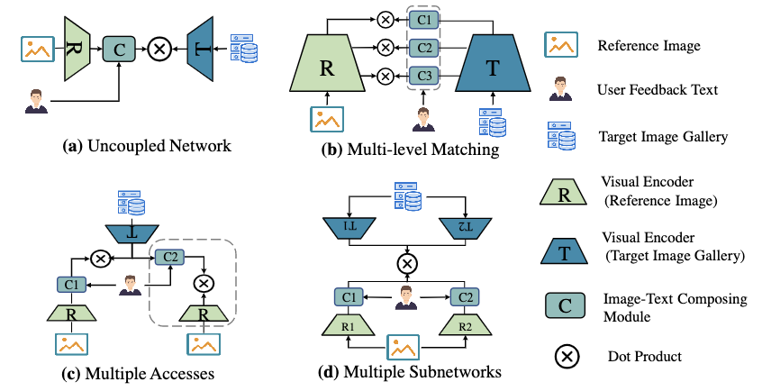
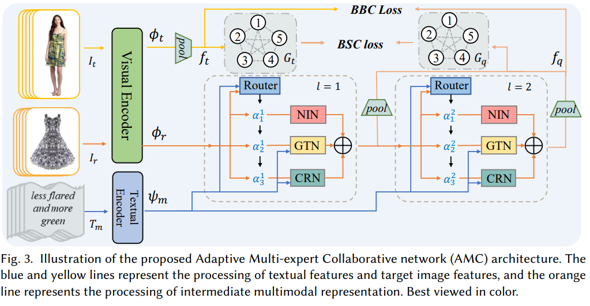
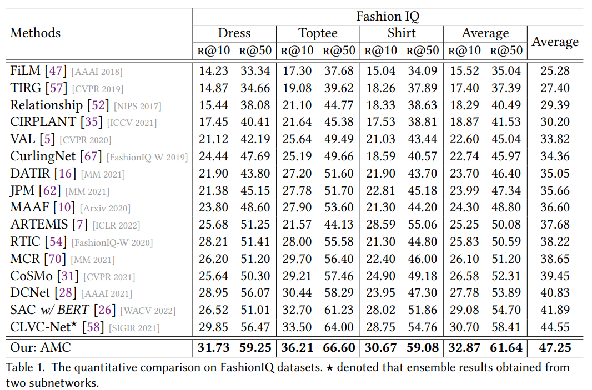
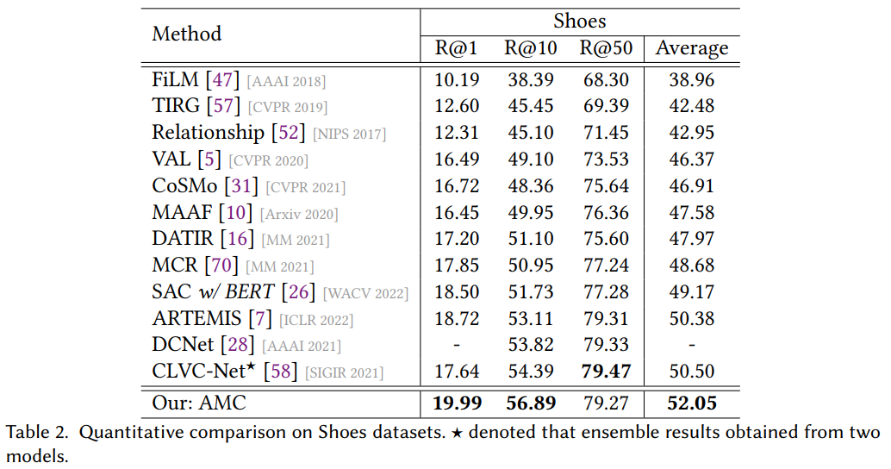

# AMC: Adaptive Multi-expert Collaborative Network for Text-guided Image Retrieval
[](https://github.com/KevinLight831/AMC/blob/main/LICENSE)
[](https://www.python.org/)
[](https://pytorch.org/) 


Official Pytorch code of [AMC: Adaptive Multi-expert Collaborative Network for Text-guided Image Retrieval](https://dl.acm.org/doi/abs/10.1145/3584703)

## :open_book: Introduce
Text-guided image retrieval integrates reference image and text feedback as a multimodal query to search the
image corresponding to user intention. Recent approaches employ multi-level matching, multiple accesses, or
multiple subnetworks for better performance regardless of the heavy burden of storage and computation in
the deployment. Besides, these models not only rely on expert knowledge to handcraft image-text composing
modules but also do inference by the static computational graph. It limits the representation capability and
generalization ability of networks in the face of challenges from complex and varied combinations of reference
image and text feedback. To break the shackles of the static network concept, we introduce the dynamic
router mechanism to achieve data-dependent expert activation and flexible collaboration of multiple experts
to explore more implicit multimodal fusion patterns. Specifically, we construct our Adaptive Multi-expert
Collaborative network (AMC) by using the proposed router to activate the different experts with different
levels of image-text interaction. Since routers can dynamically adjust the activation of experts for the current
samples, AMC can achieve the adaptive fusion mode for the different reference image and text combinations
and generate dynamic computational graphs according to varied multimodal queries. Extensive experiments
on two benchmark datasets demonstrate that benefits from the image-text composing representation produced
by adaptive multi-expert collaboration mechanism, AMC has better retrieval performance and zero-shot
generalization ability than the state-of-the-art method while keeping the lightweight model and fast retrieval
speed. 
<p align="center"></p>

## :fire: Train
Training on the Fashion-IQ dataset
```
sh ./shell/IQ.sh
```
Training on the Shoes dataset
```
sh ./shell/shoes.sh
```
 
## :snowflake: Evaluation

Evaluation of the Fashion-IQ and Shoes dataset.
```
sh ./shell/eval_IQ.sh
```

Evaluation of the ensemble model.
```
sh ./shell/eval_ensemble.sh
```
:label: Note: When training or evaluating, you need to modify the default data and model path to yourself path.

## :wrench: Setup and Environments
    Python: 3.6
    Pytorch: 1.7.1
    RTX 3090
    Ubuntu 14.04.6 LTS

Install packages:
```
pip install -r requirements.txt
```

## :file_folder: Dataset
Download the Fashion-IQ dataset by following the instructions on [XiaoxiaoGuo](https://github.com/XiaoxiaoGuo/fashion-iq). follow the [XiaoxiaoGuo](https://github.com/XiaoxiaoGuo/fashion-iq) and [CLVC-NET](https://anosite.wixsite.com/clvcnet/code), we first resize the downloaded images by resize_images.py.

Because more and more download links to Fashion-IQ images are being taken down, you can also use the stored [dataset version](https://drive.google.com/drive/folders/14JG_w0V58iex62bVUHSBDYGBUECbDdx9?usp=sharing) from the author of [CoSMo](https://github.com/postBG/CosMo.pytorch).

It seems like the [raw download link](http://tamaraberg.com/attributesDataset/index.html) of Shoes dataset cannot be accessed. In order to facilitate the follow-up studies in this field, we have uploaded a version of Shoes dataset in [Google Drive](https://drive.google.com/file/d/1tI_gc7k-grn-EvCwcZOFE6DeEL24JEou/view?usp=share_link). Please be aware that this link is not permanent, and may be taken down in the future. Besides, we don‘t own this dataset and please remember to claim the raw source of this dataset.

## :pushpin: Pretrained Model Weight 
The pretrained weight are stored in [Google Driver](https://drive.google.com/file/d/1GpCAYoyYLKO_wfMYffCzV4U3cwqCWRcr/view?usp=share_link). There are two model weights: DCR_sim_0 and DCR_sim_1. They can evaluate the ensemble performance.

## :rainbow: Model Architecture

<p align="center"></p>

## :balance_scale: Main Results

### Fashion-IQ dataset

<p align="center"></p>

### Shoes dataset

<p align="center"></p>

## :pencil: Citation
If this codebase is useful to you, please cite our work:
```
@article{zhu2023amc,
  title={AMC: Adaptive Multi-expert Collaborative Network for Text-guided Image Retrieval},
  author={Zhu, Hongguang and Wei, Yunchao and Zhao, Yao and Zhang, Chunjie and Huang, Shujuan},
  journal={ACM Transactions on Multimedia Computing, Communications and Applications},
  year={2023}
}
```

## :panda_face: Contacts
If you have any questions, please feel free to contact me: zhuhongguang1103@gmail.com or hongguang@bjtu.edu.cn.

## :books: Reference
1. Lee, Seungmin, Dongwan Kim, and Bohyung Han. "Cosmo: Content-style modulation for image retrieval with text feedback." Proceedings of the IEEE/CVF Conference on Computer Vision and Pattern Recognition. 2021.
2. Wen, Haokun, et al. "Comprehensive linguistic-visual composition network for image retrieval." Proceedings of the 44th International ACM SIGIR Conference on Research and Development in Information Retrieval. 2021.
